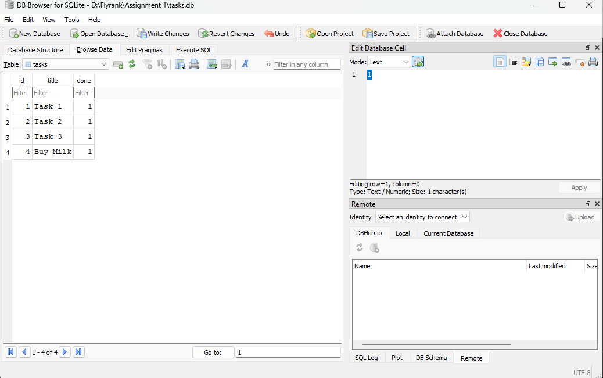

# FlyRank Task API (Database Version)

A simple CRUD API that manages a to-do list, built with Python and FastAPI. 
Developed by Muhammad Obaidullah.

## Why SQLite?
For this version, the storage layer was moved from an in-memory list to a real SQLite database. SQLite was chosen because it requires zero setup, uses a single file, and ensures our data survives server restarts.

## Database Information
The database file is automatically created as `tasks.db` in the root folder when the application runs for the first time. The `tasks` table is also created automatically and seeded with three example tasks if it is empty.

## How to Run
Run the following command in your terminal to start the server:
```bash
uvicorn main:app --reload
```

## Example SQL Query
During testing, I used DB Browser to interact with the database directly. Here is an example query I ran:
```sql
SELECT * FROM tasks WHERE done = 1;
```
*Result: This query returned all tasks that have been marked as completed (done).*

## Endpoints

| Method | Path | Meaning |
|---|---|---|
| GET | `/` | API details |
| GET | `/health` | Health check |
| GET | `/tasks` | List all tasks |
| GET | `/tasks/{id}` | Get a specific task |
| POST | `/tasks` | Create a new task |
| PUT | `/tasks/{id}` | Update a task |
| DELETE | `/tasks/{id}` | Delete a task |

## Database View
