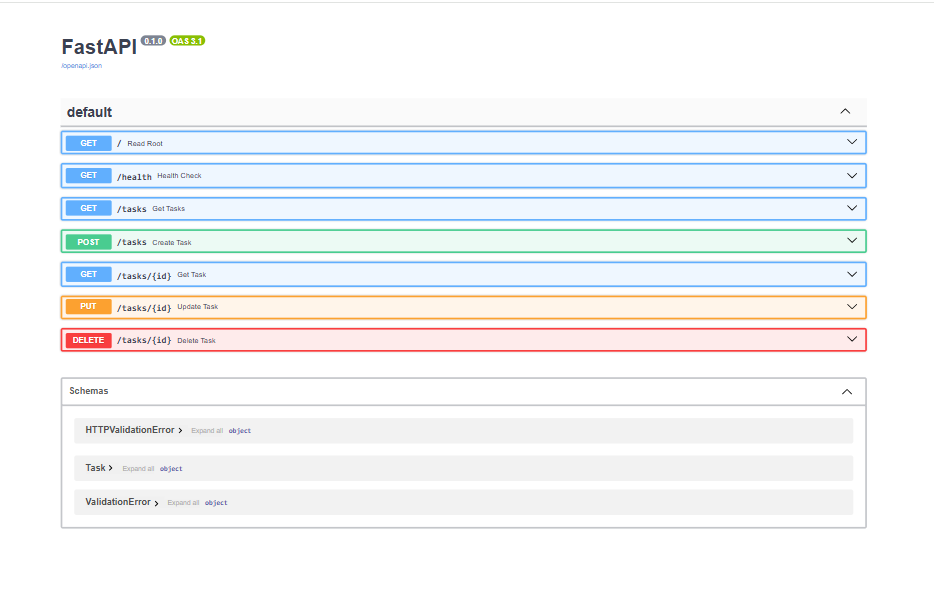

# FlyRank Task API

A simple CRUD API that manages a to-do list, built with Python and FastAPI. 
Developed by Muhammad Obaidullah.

## How to Run
Run the following command in your terminal to start the server:
`uvicorn main:app --reload`

## Endpoints

| Method | Path | Meaning |
|---|---|---|
| GET | `/` | API details |
| GET | `/health` | Health check |
| GET | `/tasks` | List all tasks |
| GET | `/tasks/{id}` | Get a specific task |
| POST | `/tasks` | Create a new task |
| PUT | `/tasks/{id}` | Update a task |
| DELETE | `/tasks/{id}` | Delete a task |

## cURL Output Example
```bash
curl -i http://localhost:8000/health

HTTP/1.1 200 OK
server: uvicorn
content-length: 15
content-type: application/json

{"status":"ok"}
```

## Swagger UI Documentation
