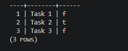

# FlyRank Task API (Docker Version)

A simple CRUD API that manages a to-do list, built with Python, FastAPI, and PostgreSQL. 
Developed by Muhammad Obaidullah.

## Why Docker & PostgreSQL?
For this version, the storage layer was moved from SQLite to a robust PostgreSQL database, and the entire stack was containerized using Docker Compose. This ensures zero manual setup, environment consistency, and allows the whole stack to run with a single command.

## Database Information
The database runs inside a dedicated PostgreSQL container (`db`). The `tasks` table is created automatically and seeded with three example tasks if it is empty upon the first startup.

## How to Run
Run the following command in your terminal to start the entire stack (API + Database):
```bash
docker compose up --build
```

## Environment Variables
Before running the application, set up your environment variables by pointing to the example file:
```bash
cp .env.example .env
```

## Endpoints

| Method | Path | Meaning |
|---|---|---|
| GET | `/` | API details |
| GET | `/health` | Health check |
| GET | `/tasks` | List all tasks |
| GET | `/tasks/{id}` | Get a specific task |
| POST | `/tasks` | Create a new task |
| PUT | `/tasks/{id}` | Update a task |
| DELETE | `/tasks/{id}` | Delete a task |

## Example Request 
To test the API, you can use this curl command:
```bash
curl -i http://localhost:8000/tasks
```

## Database View
